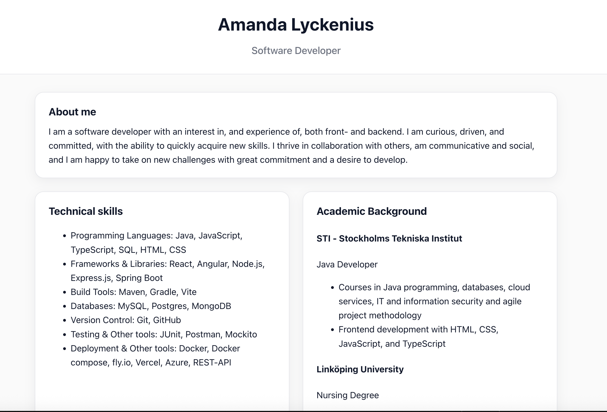
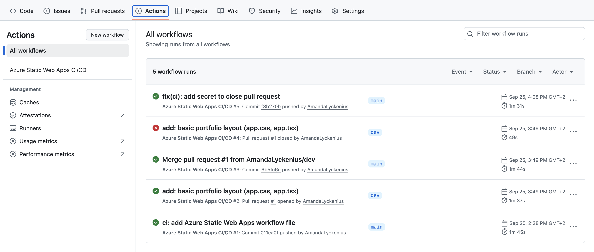
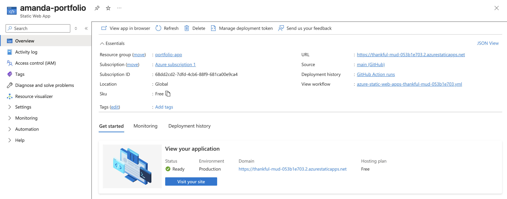
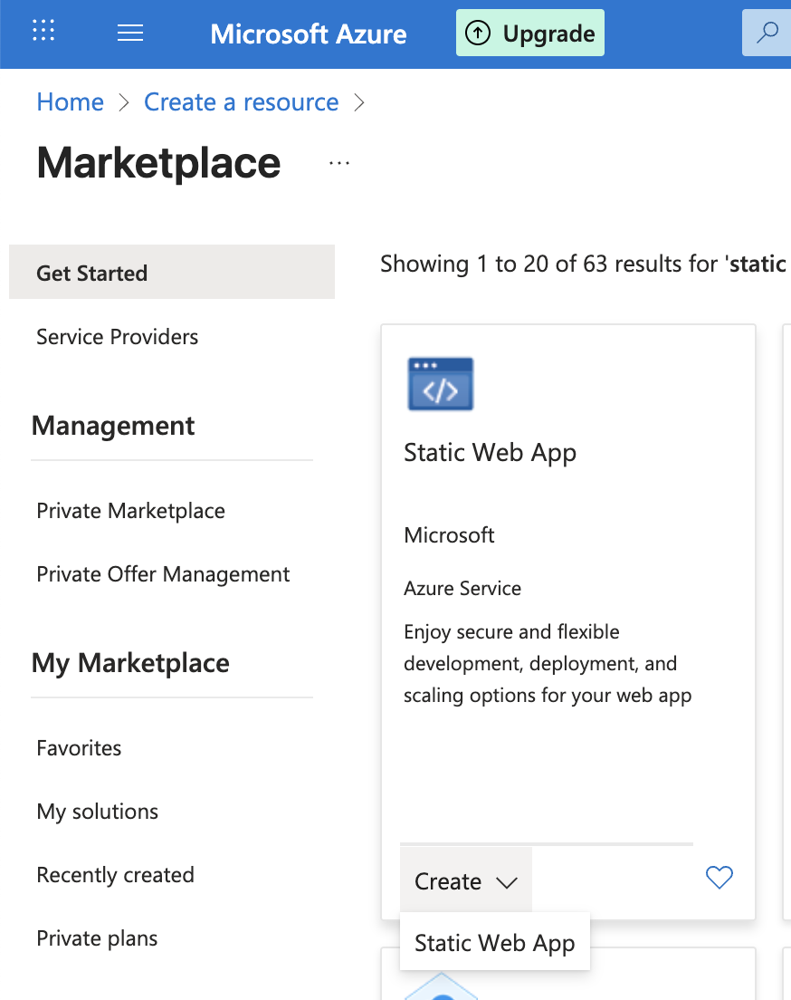
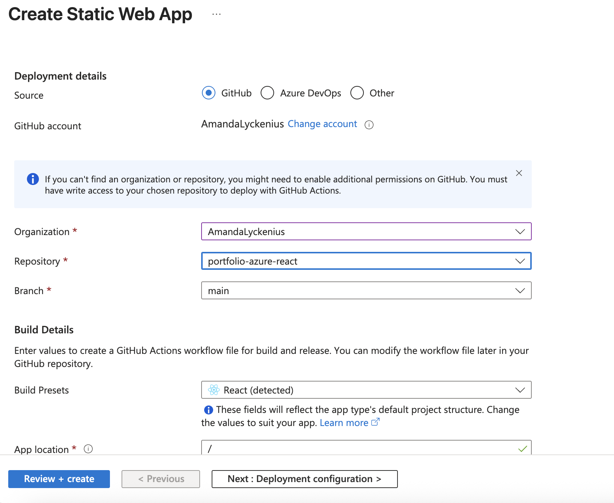

# React‑portfolio på Azure Static Web Apps

> Min personliga portfolio byggd i React, och hostad på **Azure Static Web Apps** med automatisk deploy tack vare **GitHub Actions**.

---

## Live‑demo

[https://thankful-mud-053b1e703.2.azurestaticapps.net/](https://thankful-mud-053b1e703.2.azurestaticapps.net/)
---

## Vad gör den här portfolion bra?

* Snabb och överskådlig presentation av mina tekniska färdigheter och min akademiska bakgrund.
* Länkar till min GitHub och LinkedIn
* Hostad på Azure för stabil och kostnadseffektiv drift med CI/CD från GitHub.

---

## Screenshots

**Startsida**  



**Deploy-pipeline (GitHub Actions)**  



**Azure SWA översikt**  



---

## Tech‑stack

* **React** (Create React App)
* **TypeScript**
* **Styling:** CSS Modules
* **CI/CD:** GitHub Actions (Azure Static Web Apps)
* **Hosting:** Azure Static Web Apps

---

## Kom igång lokalt

```bash
# Klona
git clone https://github.com/AmandaLyckenius/portfolio-azure-react.git
cd portfolio-azure-react

# Installera
npm install

# Starta lokalt
npm start

# Bygg för produktion
npm run build 
```
---

## Deploy till Azure Static Web Apps

### 1) Skapa SWA från GitHub‑repo


* I Azure Portal: **Create resource → Static Web App**

* Välj GitHub‑repo och branch (ofta `main`).
* **Build presets:** Välj *React*
* **App location:** `/` (roten, om din `package.json` ligger där)
* **Build output location:**
  * CRA: `build`

Detta skapar automatiskt en **GitHub Actions**‑workflow i `.github/workflows/`.

### 2) GitHub Actions (exempel på workflow)

> Filen skapas av Azure, men ungefär så här kan den se ut. 
```yaml
name: Azure Static Web Apps CI/CD
on:
  push:
    branches: [ main ]
  pull_request:
    types: [opened, synchronize, reopened, closed]
    branches: [ main ]
jobs:
  build_and_deploy_job:
    if: github.event_name == 'push' || (github.event_name == 'pull_request' && github.event.action != 'closed')
    runs-on: ubuntu-latest
    name: Build and Deploy Job
    steps:
      - uses: actions/checkout@v4
      - name: Build And Deploy
        uses: Azure/static-web-apps-deploy@v1
        with:
          azure_static_web_apps_api_token: ${{ secrets.AZURE_STATIC_WEB_APPS_API_TOKEN }}
          repo_token: ${{ secrets.GITHUB_TOKEN }}
          action: 'upload'
          app_location: '/'              
          output_location: 'build'        
```

## Deployflöde 

1. **Push till main** → 2. **GitHub Actions bygger** → 3. **Artefakt laddas upp till SWA** → 4. **Sajten uppdateras**
